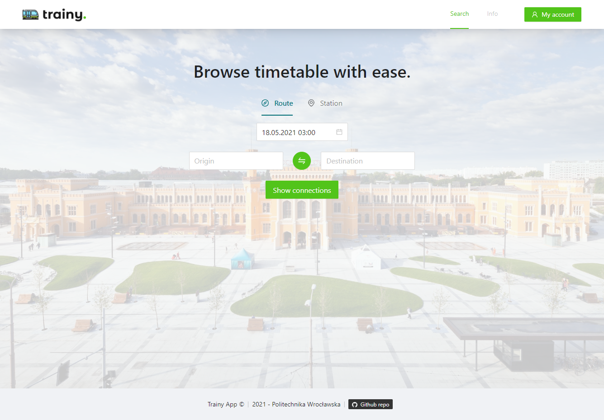
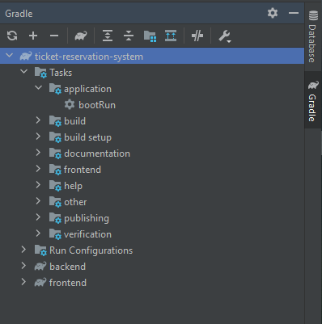
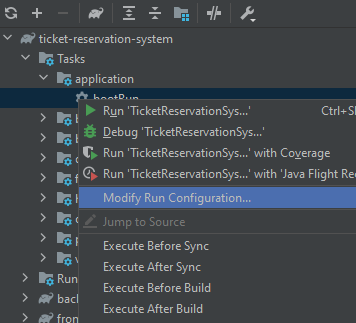
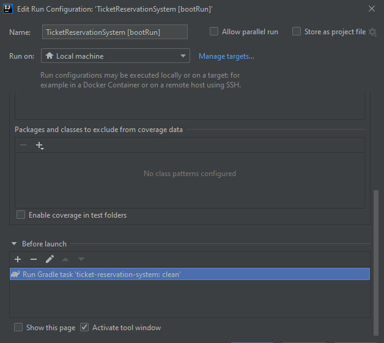

# Trainy App
#### Train ticket reservations system

A modern web application for purchasing train tickets, with the functionality to browse connections, make a personal account and go through all steps of a typical reservation (specify passengers, personal data, applicable discount tariff)


_Start page_

## Installation
The project requires [JDK](https://www.oracle.com/java/technologies/javase-jdk11-downloads.html) v11 to run.

Clone the project onto your machine.
```sh
git clone https://github.com/jcholuj/TicketReservationSystem.git
```

## Launching the project
- At first run the following task on a command line:
```sh
gradlew clean
```
- Then enter
```sh
gradlew bootRun
```
- Open a browser, connect to URL `http://localhost:8080`

> Note: IntelliJ launch workflow is preferred

## IntelliJ workflow

Since it's a dedicated IDE for Java/Kotlin projects, everything is as user-friendly as possible.
When opening the project, wait for the Gradle sync to commence.
Then:
- go to the dedicated Gradle panel:
  
- modify the run configuration of the `bootRun` task
  
- in the **Code Coverage** area add a "Before Launch" task - `ticket-reservation-system : clean`
  

Finally, just double-click the `bootRun` task, and the project should enter the sequence _Clean - Build - Run_

## Front-end scripts
Described here for use-cases when only the front-end part of the project is needed.
In the `frontend` directory, you can run:
### `npm start`

Runs the app in the development mode.\
Open [http://localhost:3000](http://localhost:3000) to view it in your browser.

The page will reload when you make changes.\
You may also see any lint errors in the console.

### `npm run build`

Builds the app for production to the `build` folder.\
It correctly bundles React in production mode and optimizes the build for the best performance.

The build is minified, the filenames include the hashes.\
The app is ready to be deployed!

See the section about [deployment](https://facebook.github.io/create-react-app/docs/deployment) for more information.

### `npm run clean`

**Note: no need to use this while working only on the front-end side**

Cleans the output directory `build` (automatically launches when used in the global Gradle `clean` task)

## Gradle configuration

Following the recommendations from the [frontend-gradle-plugin][gradle-setup] which is essential for processing the front-end resources simultaneously with the back-end. Therefore, 3 Gradle configs are provided:
- `settings.graddle` in the project root
  containing this line:
```groovy
include 'backend', 'frontend'
```
- `build.graddle` in the frontend directory where the **frontend-gradle-plugin** is configured
```groovy
frontend {
    nodeVersion = '14.16.1'
    installScript = 'install -s'
    assembleScript = 'run build'
    cleanScript = 'run clean'
    checkScript = 'run check'
}
```
- `build.graddle` in the backend directory where all the necessary profiles for the Spring Boot are included
```groovy
plugins {
    id 'org.springframework.boot' version '2.4.4'
    id 'io.spring.dependency-management' version '1.0.11.RELEASE'
    id 'war'
    id 'java'
}

dependencies {
    implementation 'org.springframework.boot:spring-boot-starter'
    implementation 'org.springframework.boot:spring-boot-starter-web'
    implementation 'org.springframework.boot:spring-boot-starter-security'
    implementation 'org.springframework.boot:spring-boot-starter-data-jpa'
    runtimeOnly 'mysql:mysql-connector-java'
}
```

The frontend sub-project outputs the compiled source files in its `build` directory. A custom task named
`processFrontendResources`, defined in the backend sub-project, copies that build into the
`build/resources/main/public` directory of the backend sub-project.

The `processResources` task of the backend
sub-project depends on this `processFrontendResources` task, to ensure frontend artifacts are included when building
the WAR artifact: the `bootWar` task in the backend project automatically packages files in the
`${project.buildDir}/resources/main/public` directory into the WAR artifact so as they are publicly accessible.

## Group info
\
**Politechnika Wrocławska** - Advanced Web Technologies course lab

Authors:\
[Jędrzej Chołuj][jcholuj] | [Artem Popelyshev][apopelyshev] | [Viktor Melnyk][melnyk]

## Tech stack

○

○

○

○


[gradle-setup]: <https://github.com/siouan/frontend-gradle-plugin/tree/master/examples/multi-projects-war-application>
[jcholuj]: <https://github.com/jcholuj>
[apopelyshev]: <https://github.com/apopelyshev>
[melnyk]: <https://github.com/M3LNYK>
